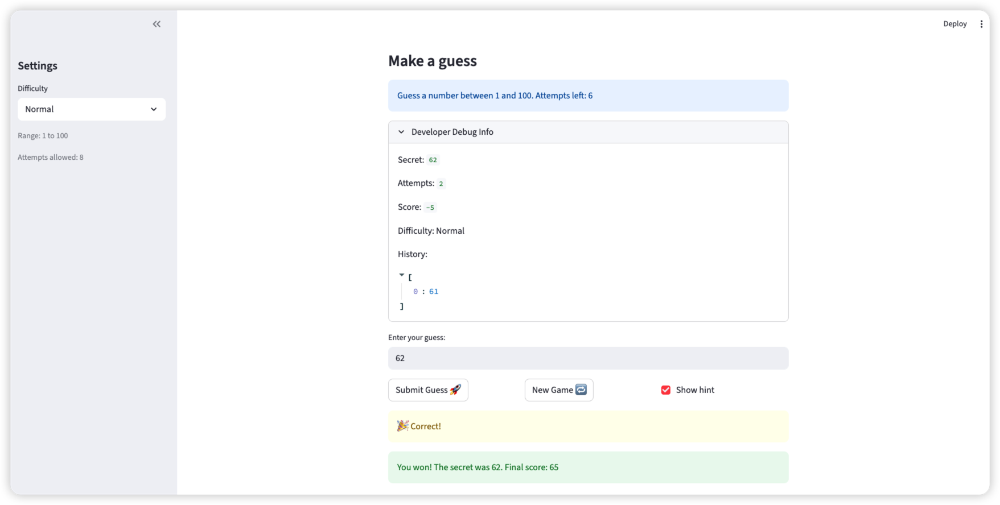

# 🎮 Game Glitch Investigator: The Impossible Guesser

## 🚨 The Situation

You asked an AI to build a simple "Number Guessing Game" using Streamlit.
It wrote the code, ran away, and now the game is unplayable. 

- You can't win.
- The hints lie to you.
- The secret number seems to have commitment issues.

## 🛠️ Setup

1. Install dependencies: `pip install -r requirements.txt`
2. Run the broken app: `python -m streamlit run app.py`

## 🕵️‍♂️ Your Mission

1. **Play the game.** Open the "Developer Debug Info" tab in the app to see the secret number. Try to win.
2. **Find the State Bug.** Why does the secret number change every time you click "Submit"? Ask ChatGPT: *"How do I keep a variable from resetting in Streamlit when I click a button?"*
3. **Fix the Logic.** The hints ("Higher/Lower") are wrong. Fix them.
4. **Refactor & Test.** - Move the logic into `logic_utils.py`.
   - Run `pytest` in your terminal.
   - Keep fixing until all tests pass!

## 📝 Document Your Experience

**Game purpose:** A number guessing game where the player tries to guess a secret number within a limited number of attempts. After each guess, the game gives a "Too High" or "Too Low" hint to guide the player toward the correct answer.

**Bugs found (7 total):**
- Bug 1: Attempt counter initialized to `1` instead of `0`, showing wrong count on page load
- Bug 2: Hint messages in `check_guess` were inverted, so "Go HIGHER!" showed when the guess was too high
- Bug 3: "New Game" only reset `attempts` and `secret`, leaving `status`/`score`/`history` stale
- Bug 4: `Attempts left` display rendered before the increment, always one step behind
- Bug 5: Developer Debug Info also rendered before increment, out of sync with `Attempts left`
- Bug 6: Test assertions expected a plain string but `check_guess` returns a `(outcome, message)` tuple
- Bug 7: `pytest` raised `ModuleNotFoundError` because `logic_utils` was not on `sys.path`

**Fixes applied:**
- Moved all four core functions into `logic_utils.py` and imported them in `app.py`
- Corrected the swapped hint messages in `check_guess`
- Fixed initial `attempts = 0` and added full session state reset in `if new_game:`
- Used `st.empty()` placeholders for both the info box and debug expander so they render after the increment
- Added `conftest.py` at the project root to fix pytest imports
- Updated tests to unpack the `(outcome, message)` tuple and added 6 new regression tests covering `parse_guess` and `update_score`

## 📸 Demo

- [x] [Insert a screenshot of your fixed, winning game here]

## 🚀 Stretch Features

- [ ] [If you choose to complete Challenge 4, insert a screenshot of your Enhanced Game UI here]
